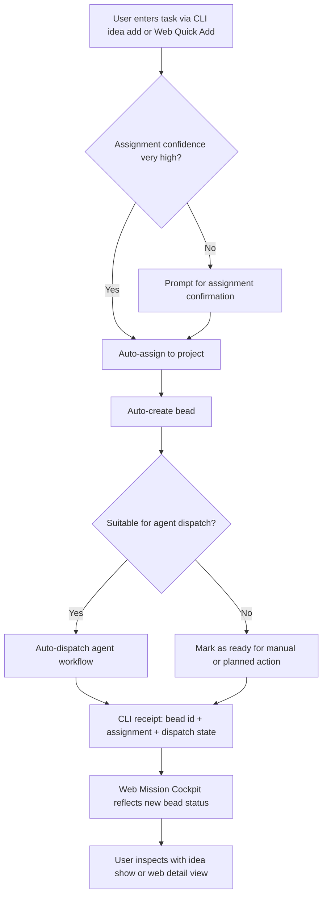
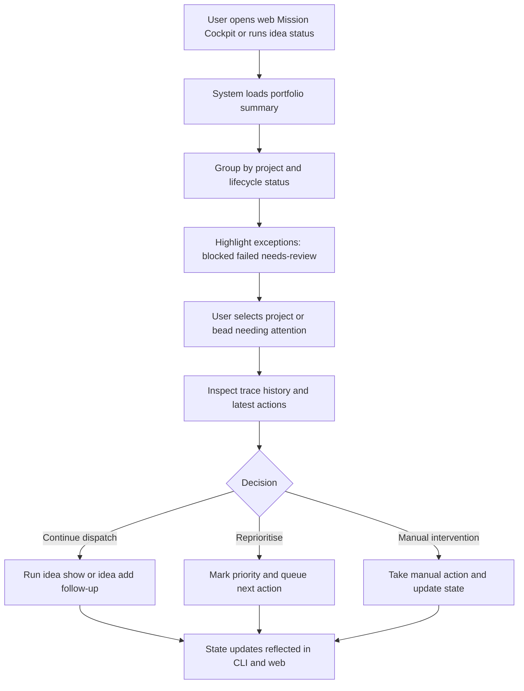
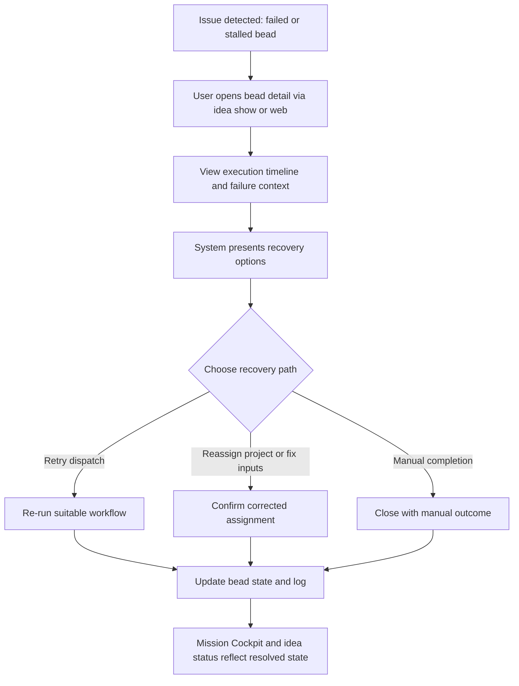
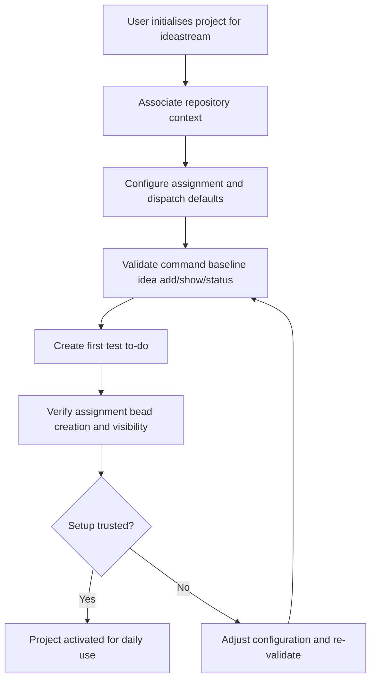

---
stepsCompleted:
  - 1
  - 2
  - 3
  - 4
  - 5
  - 6
  - 7
  - 8
  - 9
  - 10
  - 11
  - 12
  - 13
  - 14
lastStep: 14
inputDocuments:
  - _bmad-output/planning-artifacts/prd.md
---

# UX Design Specification ideastream

**Author:** Richard
**Date:** 2026-03-08

---

<!-- UX design content will be appended sequentially through collaborative workflow steps -->

## Executive Summary

### Project Vision

Ideastream is a CLI-first productivity and orchestration tool for command-line-literate users who manage repositories containing meaningful work artefacts. It helps users capture intent quickly, assign work to the correct project context, and progress that work through a trustworthy execution path. The product is designed to reduce context-switch overhead and preserve control while moving from organisation to action.

### Target Users

The primary users are computer-literate, command-line-literate individuals who need to create and maintain repositories full of content. That content is not limited to software and may include documentation, research outputs, planning artefacts, and other structured project materials. These users value low-friction capture, clear project scoping, reliable traceability, and the option to delegate suitable tasks without losing oversight.

### Key Design Challenges

1. Designing a CLI-centred experience that feels powerful without being developer-exclusive.
2. Supporting heterogeneous repository content types while keeping workflows coherent.
3. Preserving user trust through explicit state visibility, safe branching boundaries, and recoverable execution flows.

### Design Opportunities

1. Delivering a universal repository work model that works for code and non-code content equally well.
2. Creating a strong capture-to-progress moment that demonstrates immediate practical value.
3. Making cross-project context management a differentiated experience through clarity, traceability, and controlled delegation.

## Core User Experience

### Defining Experience

The defining experience for ideastream is turning a free-text to-do into correctly scoped, project-aware action while preserving user trust. Users should be able to capture intent quickly, have it assigned to the correct project, and see meaningful progress without losing control.

For MVP, two high-frequency realities shape the experience:
1. Users frequently check cross-project status to regain orientation quickly.
2. Users rely on accurate to-do assignment and correct bead construction as the product's trust anchor.

### Platform Strategy

The product should follow a dual-surface strategy:
- CLI as the operational control surface for capture, dispatch, and workflow actions.
- Lightweight webview as the visibility and guided-capture surface for cross-project state, progress, inspection, and quick to-do entry.

This approach preserves command-line power while making project-state comprehension faster and less cognitively heavy.

### Effortless Interactions

The interaction that must feel effortless is adding new to-dos.
Users should be able to capture intent in minimal input from either CLI or web UI, with:
- low-friction command structure in CLI,
- a fast web "quick add" path in Mission Cockpit,
- automatic or highly assisted project assignment,
- immediate confirmation of bead creation and state.

The system should reduce manual context reconstruction and avoid unnecessary prompts for routine capture flows.

### Critical Success Moments

1. A user captures a free-text to-do and sees it assigned to the correct project with a correctly constructed bead.
2. A user checks cross-project status and instantly understands what is waiting, in progress, and completed.
3. A user sees a to-do move from captured intent to automatic action in a way that feels useful, safe, and trustworthy.

Failure in assignment accuracy or bead construction is make-or-break for perceived product quality in MVP.

### Experience Principles

1. Trust through correctness first: assignment and bead construction must be reliable before advanced automation.
2. Capture should be near-zero friction: creating new to-dos should feel fast and natural.
3. Visibility without overload: cross-project status must be legible at a glance.
4. Automation with accountability: action should feel exciting, but always traceable and inspectable.
5. CLI power, web clarity: execute quickly in CLI or create via guided web intake, with shared state semantics across both.

## Desired Emotional Response

### Primary Emotional Goals

The primary emotional goal for ideastream is confident control. Users should feel they understand what the system is doing, what is expected from them, and how to steer outcomes safely. A secondary emotional goal is empowerment: users should feel that the tool extends their capability rather than replacing their judgment.

### Emotional Journey Mapping

1. Discovery and setup:
Users should feel in control from the start, with clear expectations and transparent setup steps.

2. Daily use and status checks:
The dominant emotion should be confidence that work is under control across projects and nothing important is being lost.

3. After to-do capture and automatic action:
Users should feel amazement at the speed and usefulness of turning intent into visible progress.

4. Error or exception states:
Users should remain calm, supported by clear explanations, safe boundaries, and obvious next actions.

5. Return usage:
Users should feel trust and momentum, expecting reliable orientation and dependable follow-through.

### Micro-Emotions

Critical micro-emotions to cultivate:
- Clarity over ambiguity during setup and operation.
- Confidence over hesitation when dispatching work.
- Trust over scepticism when viewing assignment and bead state.
- Accomplishment and momentum after successful automation.
- Calm agency during troubleshooting and recovery.

### Design Implications

To produce the target emotional outcomes, UX should emphasise:
- Explicit state visibility for projects, to-dos, and bead lifecycle.
- Immediate, unambiguous confirmation for assignment and bead creation.
- Safe-by-design workflows for repository and to-do integrity.
- Transparent recovery paths with actionable guidance when failures occur.
- Lightweight celebratory feedback for successful automatic action.

Emotion-design connections:
- Confident control -> clear status models, predictable command outcomes, inspectable history.
- Amazement -> fast capture-to-action loop with visible progress.
- Calm under failure -> plain-language diagnostics, recovery suggestions, and preserved state.
- Trust -> correctness-first handling of assignment, bead construction, and safety boundaries.

### Emotional Design Principles

1. Explain before it surprises: users should understand why outcomes occurred.
2. Confidence by default: every core action should return clear state and next steps.
3. Celebrate progress, not opacity: automation should feel impressive and understandable.
4. Calm failure handling: problems should be recoverable without panic.
5. Protect both code and intent: repository safety and to-do integrity are equal trust anchors.

## UX Pattern Analysis & Inspiration

### Inspiring Products Analysis

#### Obsidian

Obsidian is strong at helping users coordinate ideas that are richer than single-line tasks. It supports building a project knowledge base over time, with content that remains connected and explorable. This aligns with ideastream's need to support repository content beyond software, including research and documentation.

Key strengths to learn from:
- Structured yet flexible content organisation.
- Strong sense of project context accumulation over time.
- User feeling of ownership and control over their information architecture.

Observed gap relative to ideastream goals:
- No obvious built-in agentic dispatch workflow.
- No clearly central, low-friction CLI-first capture model for quick operational intake.

#### GitHub

GitHub combines repository context and issue tracking in one ecosystem, which is valuable for tying work items to code and project state. It establishes strong traceability around work artefacts and repository actions.

Key strengths to learn from:
- Repository-linked work tracking with visible state.
- Clear artefact history and accountability model.
- Familiar workflow vocabulary for project progression.

Observed gap relative to ideastream goals:
- Limited direct agentic linkage between captured intent and automatic action.
- Issue capture and lifecycle interactions can feel clunky for rapid day-to-day task intake.

### Transferable UX Patterns

Navigation and context patterns to adapt:
- Persistent project context that makes it easy to understand where each work item belongs.
- Clear linkage between work items and underlying repository artefacts.
- History-first visibility so users can inspect what happened, not just current status.

Interaction patterns to adapt:
- Rich content support beyond single-line tasks (notes, context, references, evolving detail).
- Explicit status transitions that remain understandable at a glance.
- Deterministic audit trails for operations that affect execution or repository state.

Visual and feedback patterns to adapt:
- Context panels and linked views that reduce mental context switching.
- State labels and progress indicators that emphasise clarity over ornament.
- Lightweight acknowledgement of successful automation to reinforce momentum.

### Anti-Patterns to Avoid

1. Clunky task intake flows that require too much structure before capture.
2. Disconnected systems where project organisation and execution are not linked.
3. Opaque automation that acts without clear state visibility or traceability.
4. Code-centric assumptions that exclude non-software repository content use cases.
5. Overly rigid issue/work-item schemas that slow early idea capture.

### Design Inspiration Strategy

What to adopt:
- Obsidian-like project knowledge coordination for rich, evolving content.
- GitHub-like repository traceability and state legibility.

What to adapt:
- Issue/task models into faster, CLI-first intake with optional structure expansion.
- Repository-linked workflows into a clearer, less clunky dispatch-and-review loop.

What to avoid:
- Heavyweight capture rituals before users can record intent.
- Weak links between to-do capture, assignment correctness, bead construction, and execution visibility.

Strategic direction:
Ideastream should combine the contextual richness of content-oriented tools with the operational traceability of repository platforms, then add its differentiator: trustworthy, inspectable agentic action from captured intent.

## Design System Foundation

### 1.1 Design System Choice

Ideastream should use a themeable, utility-first component stack for the lightweight webview:
- Tailwind CSS for design tokens and layout control,
- Radix UI primitives for accessible interaction foundations,
- shadcn/ui as the composable component baseline,
- optional Headless UI components where they provide a better fit for specific patterns.

The CLI remains the execution/control surface; the webview remains the visibility and inspection surface.

### Rationale for Selection

This stack is a strong fit for ideastream because it balances speed, accessibility, and product-specific UX expression:

1. Fast MVP delivery with control:
shadcn/ui provides ready-to-adapt components without locking ideastream into a heavy visual system.

2. Accessibility-first primitives:
Radix provides robust keyboard/focus and interaction behaviour for trust-critical status and inspection views.

3. Visual flexibility:
Tailwind enables precise, semantic, state-driven styling needed for nuanced lifecycle signals.

4. Product distinctiveness:
The stack avoids a generic dashboard look while keeping consistency through shared tokens and component recipes.

5. Long-term maintainability:
Composable primitives and local component ownership support gradual hardening and refinement over time.

### Implementation Approach

Use a dual-surface model:
- CLI: command execution, capture, assignment, dispatch, and inspection operations.
- Webview: cross-project visibility, quick to-do capture, bead lifecycle tracking, event history, and recovery guidance.

Webview build approach:
- Define a token layer using CSS variables (mapped to Tailwind theme values).
- Build ideastream-specific UI primitives on top of Radix/shadcn patterns.
- Standardise status semantics (`waiting`, `in-progress`, `blocked`, `completed`, `failed`, `needs-review`).
- Keep state rendering deterministic and traceable to CLI/domain model outcomes.

### Customization Strategy

1. Semantic token system:
Create explicit tokens for lifecycle states, confidence feedback, and error/recovery messaging with WCAG AA contrast targets.

2. Status-first component set:
Prioritise reusable components for status chips, event timeline rows, project health summaries, and dispatch confirmations.

3. Calm failure UX:
Use plain-language error surfaces with visible recovery actions and minimal alarmist styling.

4. Momentum cues:
Introduce subtle success feedback for capture-to-action completion to reinforce amazement without noise.

5. Content-aware composition:
Support both concise task records and richer contextual artefacts (notes, references, operational details) in one coherent layout system.

6. Progressive component hardening:
Start with MVP-critical components, then refine variants and interaction details based on real usage.

## 2. Core User Experience

### 2.1 Defining Experience

The defining experience for ideastream is transforming free-text intent into correctly scoped, actionable work with minimal friction and high trust.

In the webview context, the core flow is:
capture free-text to-do -> correct project assignment -> correct bead construction -> immediate visible state/action.

In the CLI context, the interaction is optimised for speed and precision:
capture command -> bead created -> bead ID and construction summary returned.
The CLI does not need rich visual state transitions, but it must provide deterministic confirmation of what happened.

### 2.2 User Mental Model

Users should think of ideastream as:
1. A reliable intake layer for project-scoped intent.
2. An automatic work constructor (bead creation is automatic).
3. A selective dispatcher that only delegates when suitability criteria are met.
4. A transparent system where confidence and uncertainty are made explicit.

Users expect automation where reliability is high, and confirmation where confidence is lower.

### 2.3 Success Criteria

The core experience succeeds when:
1. Bead construction happens automatically and correctly from free-text input.
2. Project assignment is automatic only at very high confidence; otherwise confirmation is required.
3. Agent dispatch occurs automatically only when planning/suitability criteria are met.
4. CLI users receive immediate, unambiguous output including bead ID and bead-construction summary.
5. Webview users can immediately see state progression tied to the created bead.

### 2.4 Novel UX Patterns

Ideastream combines familiar and novel patterns:

Established patterns:
- Fast command-based task capture.
- Confirm-on-uncertainty for potentially incorrect classification.
- Explicit operation receipts (ID + summary + next action hints).

Novel combination:
- Automatic bead construction as a first-class default.
- Confidence-threshold assignment policy (auto only at very high confidence).
- Conditional automatic dispatch based on planning-cycle suitability rules.
- Unified semantics across CLI execution and webview visibility.

### 2.5 Experience Mechanics

1. Initiation
- User submits free-text intent via CLI or webview input.
- System parses intent and performs project assignment confidence evaluation.

2. Assignment decision
- If confidence is very high: assign automatically.
- If confidence is below threshold: require user confirmation before final assignment.

3. Bead construction
- Bead is created automatically once assignment is accepted/determined.
- System records bead metadata and links it to project and source to-do.

4. Dispatch decision
- System evaluates suitability via planning-cycle rules.
- If suitable: dispatch to agent automatically.
- If not suitable: keep in non-dispatched state with clear next-step guidance.

5. Feedback and completion
- CLI response includes bead ID, assignment result, construction details, and dispatch status.
- Webview confirms successful to-do creation and reflects new bead and current lifecycle state immediately.
- User can inspect history and follow recommended next actions.

## Visual Design Foundation

### Color System

Ideastream should use a neutral-first palette with clear semantic state colours, prioritising legibility and trust over decorative styling.

Base palette direction:
- Foundation neutrals: slate/stone range for surfaces, text, and structural hierarchy.
- Primary action colour: deep teal/blue-green to signal calm control and operational confidence.
- Accent colour: restrained amber for attention and momentum moments.
- Success/error/warning/info: explicit semantic tones with strong contrast and consistent meaning.

Proposed semantic mapping:
- Primary: command and confirm actions.
- Secondary: supportive actions and contextual emphasis.
- Success: completion, healthy dispatch outcomes.
- Warning: needs review, low confidence, pending confirmation.
- Error: failed execution, blocked progress.
- Info: system guidance, traceability cues, neutral operational notes.

State colour requirements:
- Status colours must be recognisable in both light and dark contexts.
- Status meaning must not depend on colour alone (iconography + labels required).
- Token naming should follow domain semantics (`status-waiting`, `status-in-progress`, `status-blocked`, `status-completed`, `status-failed`, `status-needs-review`).

### Typography System

Typography should communicate precision and calm, while supporting both data-dense status views and richer project content.

Type strategy:
- UI typeface: a modern, highly legible sans-serif for navigation, controls, and tabular/status surfaces.
- Optional mono companion: for bead IDs, command snippets, execution traces, and code-like artefacts.

Hierarchy:
- Clear heading tiers for project-level orientation.
- Compact but readable body size for dense operational views.
- Distinct styling for metadata (timestamps, IDs, state tags) to reduce scanning effort.

Readability goals:
- Prioritise quick scanning for cross-project status checks.
- Preserve comfort for longer contextual content (notes, rationale, summaries).
- Keep line length and line height tuned for mixed dashboard/document usage.

### Spacing & Layout Foundation

Layout should feel structured and intentional, avoiding both clutter and excessive emptiness.

Spacing system:
- Use an 8px base spacing scale for predictable rhythm and component composition.
- Apply tighter spacing for operational rows and status lists.
- Use larger spacing intervals for section transitions and high-level orientation blocks.

Layout principles:
1. Status-first hierarchy:
Critical state information appears first, with detail progressively disclosed.
2. Stable information zones:
Project list, status summaries, and detail panes should remain spatially predictable.
3. Progressive disclosure:
Advanced trace details are available without overwhelming default views.
4. Density by context:
Cross-project overviews stay compact; deep inspection views can expand for clarity.

### Accessibility Considerations

Accessibility should target WCAG 2.2 AA as baseline.

Key requirements:
1. Contrast:
Text and status indicators must meet or exceed AA contrast thresholds.
2. Keyboard operation:
All interactive webview flows must be fully usable via keyboard.
3. Focus visibility:
Strong, consistent focus indicators for all interactive elements.
4. State communication:
Status is conveyed by label and iconography, not colour alone.
5. Motion and feedback:
Animations should be subtle, meaningful, and respect reduced-motion preferences.
6. Touch/click targets:
Interactive controls must meet minimum target sizing for reliable operation.

## Design Direction Decision

### Design Directions Explored

We explored multiple visual and interaction directions for ideastream, including command-centric, content-centric, flow-centric, and control-tower models. Through comparison, two directions emerged as the strongest fit because ideastream is intentionally dual-surface rather than single-surface.

### Chosen Direction

Ideastream will use a split design direction by interface:

1. CLI Experience: Terminal Glass
- A command-native UX language focused on explicit operation receipts.
- High clarity output for assignment confidence, bead creation, dispatch state, and next action.
- Fast, low-friction interaction with deterministic feedback.

2. Web Experience: Mission Cockpit
- A strategic control interface focused on cross-project oversight.
- Includes an embedded quick-capture path for creating new to-dos without leaving cockpit context.
- High-level telemetry for project state, dispatch health, and exception monitoring.
- Strong support for confidence review, traceability, and calm recovery workflows.

### Design Rationale

A single visual direction is not sufficient because ideastream serves two different interaction intents:

- CLI intent is execution:
Users need speed, precision, and immediate confirmation.
- Web intent is orientation and governance:
Users need broad visibility, risk awareness, recoverability across projects, and the ability to add new to-dos in context.

This split enables each surface to optimise for its core job while preserving one shared product model:
- same lifecycle semantics,
- same trust model,
- same assignment/dispatch logic.

The result is one product with two coherent UX modes rather than one compromised hybrid interface.

### Implementation Approach

1. Shared design foundation:
- Keep semantic tokens and state vocabulary consistent across CLI and web.
- Reuse lifecycle labels and status semantics (`waiting`, `in-progress`, `blocked`, `completed`, `failed`, `needs-review`).

2. CLI implementation:
- Standardise response templates for creation, assignment confidence, dispatch outcomes, and guidance.
- Emphasise compact but rich operation receipts (bead ID + summary + next step).

3. Web implementation:
- Use Mission Cockpit information hierarchy for cross-project monitoring.
- Prioritise exception surfaces, confidence indicators, and trace drill-downs.
- Support quick path from overview to bead-level inspection.

4. Cross-surface coherence:
- Ensure every web status has a CLI equivalent and vice versa.
- Preserve deterministic mapping between command output and web state representation.

5. Command identity and CLI ergonomics:
- The canonical CLI command is `idea`.
- Core user-facing command patterns include:
  - `idea add`
  - `idea show`
  - `idea status`
- Command design should prioritise memorability, predictable verbs, and clear output contracts.
- CLI output from `idea` commands must map directly to webview state semantics.

## User Journey Flows

### Journey 1: Daily Capture and Dispatch Success Path

Primary goal: move from free-text intent to trustworthy progress with minimal friction.

Interaction notes:
- CLI success response must include bead ID, assignment result, construction summary, and next command hint.
- Web Quick Add success response must include the same receipt semantics (bead ID, assignment result, dispatch state).
- Webview must show immediate lifecycle visibility and confidence context.

### Journey 2: Cross-Project Review and Prioritisation

Primary goal: regain orientation quickly and choose next action confidently.

Interaction notes:
- Default view prioritises status legibility over detail density.
- Exception-first highlighting reduces scanning effort and anxiety.

### Journey 3: Recovery and Troubleshooting

Primary goal: preserve calm and restore control when automation does not proceed cleanly.

Interaction notes:
- Error states must use calm language and explicit next actions.
- Recovery should never require hidden system knowledge.

### Journey 4: Initial Project Setup and Operational Control

Primary goal: establish reliable project boundaries and predictable workflow behaviour.

Interaction notes:
- Setup flow should make expectations explicit and avoid hidden assumptions.
- First-run validation should create confidence before everyday usage.

### Journey Patterns

Common reusable UX patterns across journeys:
- Confidence-threshold gating for assignment decisions.
- Automatic bead creation as default, with explicit receipts.
- Dual-surface parity: every CLI state has a web equivalent.
- Exception-first visibility for fast triage.
- Traceable state transitions for trust and recoverability.

### Flow Optimization Principles

1. Minimise steps from capture to verified state.
2. Prefer automation when confidence is high; prompt when confidence is uncertain.
3. Keep command responses compact but complete.
4. Show most critical status first in webview.
5. Make recovery pathways explicit, calm, and one step away.

## Component Strategy

### Design System Components

Using Tailwind + Radix + shadcn/ui (with optional Headless UI), ideastream should rely on these foundation components out of the box:

- Navigation primitives: sidebar, tabs, breadcrumbs, command palette.
- Data display: table, list, badge, tooltip, popover, accordion.
- Feedback and state: alert, toast, progress, skeleton, empty state containers.
- Input and control: input, textarea, select, combobox, checkbox, switch, dialog.
- Layout primitives: card, separator, sheet/drawer, resizable panels.
- Accessibility infrastructure: focus management, keyboard navigation, aria-ready interactive primitives from Radix.

These cover most generic UI needs for Mission Cockpit and detail inspection screens.

### Custom Components

The following components are ideastream-specific and should be designed as first-class custom components:

#### 1. Bead Lifecycle Chip

Purpose: Display bead lifecycle with semantic clarity.
States: `waiting`, `in-progress`, `blocked`, `completed`, `failed`, `needs-review`.
Variants: compact (table/list) and expanded (detail panel).
Accessibility: icon + text label; never color-only.

#### 2. Dispatch Decision Card

Purpose: Explain why a bead was auto-dispatched or held.
Content: suitability outcome, rule summary, next action.
Actions: retry evaluation, manual dispatch, edit plan.

#### 3. Operation Receipt Block (CLI Parity Component)

Purpose: Mirror `idea` command output semantics in webview.
Content: command verb, bead ID, assignment result, dispatch status, suggested next command.
Usage: shown in recent activity and bead detail views.

#### 4. Trace Timeline

Purpose: Provide chronological, inspectable execution history.
Content: timestamped events, actor (user/system/agent), state transition, links to artefacts.
States: normal, warning, error event emphasis.

#### 5. Exception Triage Panel

Purpose: Prioritise blocked/failed/needs-review items across projects.
Behavior: supports quick filtering, ownership, and path-to-recovery actions.

#### 6. Project Health Radar

Purpose: Mission Cockpit summary of per-project flow health.
Content: queue depth, failure rate, stalled beads, recent completions.
Behavior: click-through to filtered project views.

#### 7. Assignment Resolution Prompt (Pre-Entry)

Purpose: Resolve assignment uncertainty before bead entry.
Policy: only 100% certain assignments are admitted into the main bead workflow.
Behavior: if certainty is below 100%, require explicit user resolution before creation/entry.
Scope: pre-entry interaction, not a persistent in-flow confidence display component.

#### 8. Web Quick Add Panel

Purpose: Enable fast to-do creation directly from Mission Cockpit.
Content: free-text to-do field, optional project selector, optional context/reference fields.
Behavior: supports keyboard-first submission, assignment certainty gating, and immediate receipt-style confirmation on create.
Placement: available from global cockpit header and within project detail views.

### Component Implementation Strategy

1. Build component layers:
- Layer 1: base primitives from shadcn/Radix.
- Layer 2: ideastream domain components (status, dispatch, trace, assignment resolution).
- Layer 3: surface-specific assemblies:
  - Mission Cockpit modules (web).
  - CLI output templates (`idea add`, `idea show`, `idea status`).

2. Establish domain contracts:
- Every status and dispatch component binds to the same domain enum model used by CLI.
- Ensure deterministic mapping between CLI text output and web state components.
- Enforce assignment certainty gate before bead creation so in-flow states remain deterministic.

3. Accessibility by default:
- Keyboard-first interactions.
- Semantic labeling and focus order for triage and inspection workflows.
- Clear error and recovery pathways with plain language.

4. Token-driven styling:
- Apply shared semantic tokens for state and severity.
- Keep visual variants consistent across tables, cards, chips, and timeline events.

### Implementation Roadmap

Phase 1 (MVP-critical):
1. Bead Lifecycle Chip
2. Assignment Resolution Prompt (pre-entry)
3. Operation Receipt Block
4. Trace Timeline (minimum viable)
5. Exception Triage Panel
6. Web Quick Add Panel

Phase 2 (MVP hardening):
1. Dispatch Decision Card
2. Expanded Trace Timeline interactions
3. Project Health Radar (initial telemetry tiles)

Phase 3 (Post-MVP):
1. Advanced cockpit analytics modules
2. Custom workflow-type component variants
3. Rich content-view integrations for non-code repository artefacts

## UX Consistency Patterns

### Button Hierarchy

Primary actions:
- Use for high-commitment operations (`Confirm assignment resolution`, `Dispatch`, `Retry`).
- One primary action per context panel to reduce ambiguity.

Secondary actions:
- Use for non-destructive support actions (`View trace`, `Show details`, `Filter`).

Tertiary/text actions:
- Use for low-impact navigation and optional utilities.

Destructive actions:
- Reserved styling and explicit confirmation for operations that can discard or overwrite state.

CLI parity:
- Primary/secondary semantics should map to command recommendations (`idea add`, `idea show`, `idea status`) in receipt outputs.

### Feedback Patterns

Success feedback:
- Immediate and concise.
- Include outcome + identifier + next action.
- Example pattern:
  - `Bead created: b-1452`
  - `Assignment: docs-replatform`
  - `Next: idea show b-1452`

Warning feedback:
- Used for pre-entry resolution requirements and non-blocking concerns.
- Must clearly state what is required to proceed.

Error feedback:
- Calm tone, plain language, explicit recovery options.
- Must include what failed, why (if known), and first recovery step.

Info feedback:
- For guidance, trace context, and background status updates.

### Form Patterns

Intake forms (web):
- Single dominant capture field first, optional metadata second.
- Progressive disclosure for advanced options.
- Include quick-submit behaviour (`Cmd/Ctrl+Enter`) and clear post-submit receipt with bead ID.

Assignment certainty gate pattern:
- If assignment is not 100% certain, do not create/admit bead.
- Require explicit user resolution before entry.
- Show deterministic options only (select target project, confirm, continue).

Validation:
- Inline validation with immediate clarity.
- Avoid hidden blocking conditions at submit time.

CLI form parity:
- Equivalent certainty-gate behaviour for `idea add` and related intake flows.

Web intake parity:
- Creating a to-do in web UI must invoke the same assignment, bead-construction, and dispatch rules as CLI.
- Web success and error copy should mirror CLI operation-receipt semantics.

### Navigation Patterns

Mission Cockpit navigation:
- Portfolio overview as default landing context.
- Exception-first panels for `blocked`, `failed`, `needs-review`.
- Fast drill-down from project to bead detail and trace.

Detail navigation:
- Stable breadcrumb/context path:
  - portfolio -> project -> bead -> trace event

CLI navigation parity:
- `idea status` for overview
- `idea show` for detail inspection
- command suggestions for next navigational step in outputs

### Additional Patterns

State representation:
- Every lifecycle state uses consistent label, icon, and color token.
- No color-only meaning.

Receipt pattern:
- Standard operation receipt structure across web activity cards and CLI output:
  - action
  - target
  - result
  - next action

Exception triage pattern:
- Sort by urgency first.
- Present quickest safe recovery action inline.

Empty-state pattern:
- Explain what is missing.
- Offer one clear next command/action.
- Avoid generic "no data" messaging.

Loading pattern:
- Use skeletons/placeholders for primary lists and timelines.
- Preserve layout stability while loading.

Auditability pattern:
- Every state-changing action should be traceable to actor, timestamp, and resulting state.

## Responsive Design & Accessibility

### Responsive Strategy

Ideastream uses a dual-surface model, so responsive behaviour differs by surface:

1. CLI surface:
- Terminal-first operational interface focused on deterministic outputs.
- Output contracts should be consistent by command and outcome.
- Prioritise clarity and recoverability over presentation complexity.

2. Web Mission Cockpit surface:
- Desktop/laptop is primary for portfolio monitoring.
- Tablet receives a simplified but fully functional cockpit layout.
- Mobile supports triage and quick inspection, not full heavy operations.

Design principle:
- Keep core status comprehension available on all sizes.
- Reserve dense comparative analytics for larger breakpoints.

### Breakpoint Strategy

Recommended breakpoints:
- Mobile: 320px - 767px
- Tablet: 768px - 1023px
- Desktop: 1024px - 1439px
- Wide desktop: 1440px+

Layout adaptation rules:
1. Mobile:
- Single-column stack.
- Priority order: exceptions -> project health -> recent operations -> deep details.
- Use drawers/sheets for secondary navigation and filters.

2. Tablet:
- Two-zone layout when possible (summary + focused detail).
- Collapsible side navigation and condensed telemetry blocks.

3. Desktop and wide:
- Mission Cockpit multi-panel layout.
- Persistent context zones for portfolio, triage, and trace drill-down.

### Accessibility Strategy

Target compliance:
- WCAG 2.2 AA baseline for the web surface.
- CLI accessibility parity through plain-language, structured output.

Core requirements:
1. Semantic clarity:
- Consistent lifecycle labels and explicit text for all states.

2. Keyboard-first operation:
- Full keyboard navigation for all cockpit interactions.
- No feature locked behind pointer-only interaction.

3. Focus management:
- Strong visible focus indicators.
- Predictable focus order in triage and drill-down flows.

4. Color independence:
- State meaning never conveyed by color alone.
- Pair color with iconography and text labels.

5. Readability:
- Adequate text sizing and line-height in dense status views.
- Avoid low-contrast subtle UI for critical operational information.

6. Motion safety:
- Respect reduced-motion preference.
- Use minimal, meaningful transition effects only.

### Testing Strategy

Responsive testing:
1. Validate mobile, tablet, desktop, and wide desktop layouts.
2. Test both common and edge viewport widths.
3. Verify density and readability under realistic data volume.

Accessibility testing:
1. Automated checks (axe/Lighthouse equivalents in pipeline).
2. Keyboard-only walkthrough of critical flows.
3. Screen reader validation for key pages and status components.
4. Contrast validation for all semantic state tokens.

CLI testing:
1. Verify deterministic structure of command receipts.
2. Confirm success/error/recovery messages are clear and actionable.
3. Ensure command outputs preserve semantic parity with web status meanings.

User validation:
- Include at least one round of evaluation focused on:
  - confidence of status interpretation,
  - calmness during failure handling,
  - speed of orientation across projects.

### Implementation Guidelines

1. Mobile-first CSS architecture for web components.
2. Token-driven responsive spacing and typography scales.
3. Component contracts that specify:
- required state labels,
- keyboard interactions,
- error and recovery messaging patterns.
4. Shared copy patterns between CLI and web to maintain semantic parity.
5. Define and enforce responsive acceptance criteria per feature before release.
